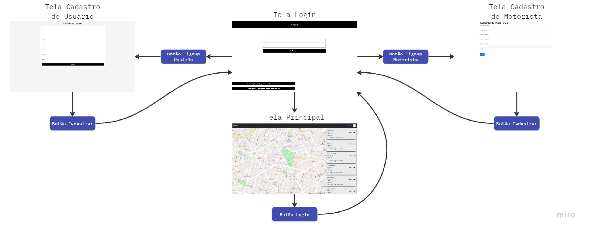

# Informações do Projeto

`VanBora`

`Engenharia de Software`

## Participantes

> Os membros do grupo são:
>
> * Rafael Moreira Barbosa Baptista
> * Bruno Guimarães de Almeida Dias Duarte

# Estrutura do Documento

- [Informações do Projeto](#informações-do-projeto)
  - [Participantes](#participantes)
- [Estrutura do Documento](#estrutura-do-documento)
- [Introdução](#introdução)
  - [Problema](#problema)
  - [Objetivos](#objetivos)
  - [Justificativa](#justificativa)
  - [Público-Alvo](#público-alvo)
- [Especificações do Projeto](#especificações-do-projeto)
  - [Personas, Empatia e Proposta de Valor](#personas-empatia-e-proposta-de-valor)
  - [Histórias de Usuários](#histórias-de-usuários)
  - [Requisitos](#requisitos)
    - [Requisitos Funcionais](#requisitos-funcionais)
    - [Requisitos não Funcionais](#requisitos-não-funcionais)
  - [Restrições](#restrições)
- [Projeto de Interface](#projeto-de-interface)
  - [User Flow](#user-flow)
  - [Wireframes](#wireframes)
- [Metodologia](#metodologia)
  - [Divisão de Papéis](#divisão-de-papéis)
  - [Ferramentas](#ferramentas)
  - [Controle de Versão](#controle-de-versão)
- [Projeto da Solução](#projeto-da-solução)
  - [Tecnologias Utilizadas](#tecnologias-utilizadas)
- [Referências](#referências)

# Introdução

## Problema

> De acordo com as nossas averiguações, observamos que, dentre os alunos de faculdades e de escolas, há a necessidade de uma forma prática e segura de se encontrar empresas que trabalhem com o transporte de pessoas a preços que sejam acessíveis.

## Objetivos

> Com a participação de empresas de transporte e prfisionais autônomos, desejamos criar uma aplicação que possa mostrar para os usuários as opções de serviços prestados, a qualidade do serviço (de acordo com avaliações de usuários)

## Justificativa

> Escolhemos trabalhar com o assunto de transporte universitário e escolar pois, ao longo de nossas vidas, dependemos sempre de empresas de transporte para nos levar às nossas intituições de ensino. Com o começo da vida universitária, nos vimos em situações complicadas, sem saber de empresas confiáveis e seguras para realizar o traslado de casa a faculdade e vice-versa. Juntamente a isso, um integrante do grupo achou interesante a oportunidade de poder lidar com um algorítimo de otimização de rotas e todos pensaram ser interesante ajudar os colegas com um problema tão comum na faculdade.

## Público-Alvo

> Como público alvo temos os alunos tanto de faculdades, que possuem facilidade de usar aplicações de transporte, quanto alunos de escolas que necessitam de formas de transporte de qualidade e com segurança.

# Especificações do Projeto

> Para a construção da VanBora, utilizamos uma série de perguntas que nos ajudariam a entender os problemas vivênciados pelos usuários da nossa aplicação. Com esse entendimento adiquirido pudemos começar a formular a base de como as coisas funcionariam no nosso aplicativo.

## Personas, Empatia e Proposta de Valor

## Histórias de Usuários

Com base na análise das personas formamos as seguintes histórias de usuários:

|EU COMO... `PERSONA`     | QUERO/PRECISO ... `FUNCIONALIDADE` |PARA ... `MOTIVO/VALOR`                 |
|-------------------------|------------------------------------|----------------------------------------|
|Usuário do sistema       | Ir para a faculdade de forma rápida e segura **sem gastar muito** | Para não chegar atrasada nas aulas |
|Motorista                | Que o site decida a melhor rota para mim e me diga o nome dos passageiros que estou buscando | Poder facilitar o processo de criação das rotas e a praticidade de transporte dos passageiros |
|Desenvolvedor            | Preciso ser capaz de monitorar as rotas dos motoristas e garantir que, se houver algum atrazo, os usuários sejam notificados | Ajudar os usuários a se comunicarem mais eficientemente com os prestadores de serviços de transporte |

## Requisitos

As tabelas que se seguem apresentam os requisitos funcionais e não funcionais que detalham o escopo do projeto.

### Requisitos Funcionais

|ID    | Descrição do Requisito                                                                | Prioridade |
|------|---------------------------------------------------------------------------------------|------------|
|RF-001| Permitir que o motorista registre sua rota no aplicativo                              | ALTA       |
|RF-002| Possuir uma forma de manter avaliações de usuários a cerca do serviço disponibilizado | MÉDIA      |
|RF-003| Forma de comunicar com o motorista                                                    | BAIXA      |
|RF-004| Forma de se cadastrar na plataforma para manter os dados das suas rotas/motorista     | ALTA       |
|RF-005| Mostrar um mapa para o usuário e para o motorista                                     | ALTA       |

### Requisitos não Funcionais

|ID     | Descrição do Requisito  |Prioridade |
|-------|-------------------------|----|
|RNF-001| O sistema deve ser responsivo para rodar em um dispositivos móvel | ALTA  | 
|RNF-002| A posição do motorista deve ser atualizada em tempo real          | MÉDIA |
|RNF-003| Devemos exibir o mapa através de uma API de mapas                 | ALTA  |
|RNF-004| O sistema deve processar a rota mais eficiente para o motorista   | ALTA  |

## Restrições

O projeto está restrito pelos itens apresentados na tabela a seguir.

|ID| Restrição                                             |
|--|-------------------------------------------------------|
|01| O projeto deverá ser entregue até o final do semestre |
|02| Não pode ser desenvolvido um módulo de backend        |

# Projeto de Interface

> Na tela de escolha do transporte, pensamos em manter um design simples para facilitar a navegação do usuário e, mesmo assim, apresentar todas as rotas viáveis ao usuário.

> Nessa tela, temos o usuário selecionando um motorista para poder ver qual a rota específica usada e o tempo que demoraria para chegar ao seu destino.

> Na tela do motorista teriamos uma lista das pessoas que ele deve pegar em sua rota, apresentando o caminho mais ágil para chegar no destino comum dos usuários.

> Na tela de login, decidimos manter um design simples para que o usuário possa registrar 

## Wireframes

> 
> 
> 
> 

# Metodologia

> A metodologia utilizada pelo grupo foi o Scrum, diante isso realizaremos reuniões semanais para saber como está o andamento do projeto. Todos do grupo participaram ativamente do processo de Design Thinking pela plataforma Miro, desde a Matriz de Alinhamento CSD até a criação das personas. Também, fizemos o Brainstorming afim de propormos soluções para nosso problema. Depois que as soluções foram propostas, analizamos cada História de Usuário e unimos as ideias em um só projeto, afim de que todos os Requisistos Funcionais e Não Funcionais fossem atentidos. A partir disso, realizamos a concepção do wireframe do projeto. Realizamos a documentação do projeto pelo Github e a apresentação por powerpoint

## Divisão de Papéis

Cada integrante do time deverá realizar as tarefas designadas para cada sprint

## Ferramentas

| Ambiente  | Plataforma              |Link de Acesso |
|-----------|-------------------------|---------------|
|Processo de Design Thinkgin  | Miro |  <https://miro.com/app/board/uXjVMY8ZlMk=> |
|Repositório de código | GitHub | <https://github.com/ICEI-PUC-Minas-PPLES-TI/plf-es-2023-1-ti1-0385100-problemas-de-mobilidade-urbana.git> |
|Hospedagem do site | Heroku |  <https://XXXXXXX.herokuapp.com> |
|Protótipo Interativo | Figma | <https://www.figma.com/file/6O7ioPlC5YJ2miFkZGBhHm/Untitled?node-id=0%3A1&t=iElEYs4dYBydv00M-1> |
|Gestor de SCRUM | Trello | <https://trello.com/invite/b/1vPLzzaZ/ATTI938ded332e35fcb6f15b84daa32d19f0FEB80672/vanbora> |
|Editor de código| VS Code |
|Ferramentas de comunicação|Whatsapp e Discord |

## Controle de Versão

A ferramenta de controle de versão adotada no projeto foi o
[Git](https://git-scm.com/), sendo que o [Github](https://github.com)
foi utilizado para hospedagem do repositório `upstream`.

O projeto segue a seguinte convenção para o nome de branchs:

- `master`: versão estável já testada do software
- `unstable`: versão já testada do software, porém instável
- `feature-test`: versão em testes do software
- `dev`: versão de desenvolvimento do software
- `old`: versão antiga do software como fallback

Quanto à gerência de issues, o projeto adota a seguinte convenção para
etiquetas:

- `bugfix`: uma funcionalidade encontra-se com problemas
- `enhancement`: uma funcionalidade precisa ser melhorada
- `feature`: uma nova funcionalidade precisa ser introduzida

**Exemplo - GitHub Feature Branch Workflow**:

# Projeto da Solução

## Tecnologias Utilizadas

> Para o desenvolvimento da aplicação, foram utilizados o Visual Studio Code e o Replit como IDEs.
> Nossa aplicação foi desenvolvida com o uso de HTML, Javascript e CSS, juntamente do framework bootstrap
> e utilizando a API de mapas do Mapbox para a apresentação do mapa na página principal da aplicação.

> # Tela de login
> Na tela de login, os usuários e motoristas tem a opção de fazer o login com sua credecial já
> cadastrada, ou caso não a possua, tem a opção de criar sua conta de acordo com sua necessidade.
> # Tela de cadastro do Usuário
> Na tela de cadastro, o usuário poderá cadastrar suas informações mais importantes para que o
> sistema possa apresentar os motoristas mais viáveis para o seu deslocamento na tela principal.
> # Tela de cadastro do Motorista
> Na tela de cadastro, o motorista informará suas informações para que o sistema possa mostrá-lo
> na tela principal de acordo com a necessidade dos usuários.
> # Tela Principal
> Nessa tela, o usuário poderá ver os motoristas que possuem como destino final seu destino para
> que possa, de acordo com a sua discreção baseada nas avaliações e nas condições do veículo,
> qual motorista proverá o melhor serviço.

# Referências

> Inclua todas as referências (livros, artigos, sites, etc) utilizados
> no desenvolvimento do trabalho.
> - [MapBox API](https://docs.mapbox.com/api/overview/)
> - [Bootstrap](https://getbootstrap.com/docs/5.3/getting-started/introduction/)
> - [Jquery API](https://api.jquery.com)